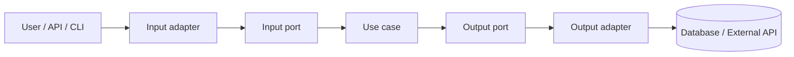

Hexagonal architecture usually becomes interesting when a backend application starts growing and the code stops having clear edges.

At first, everything feels manageable: a controller receives the request, a service performs the operation, a repository stores the data, and maybe the app calls an external API. The problem starts when those pieces blend together. The controller knows too much about the use case. The service knows too much about JPA. Business rules depend on Spring annotations. Changing one integration breaks tests that should not know that integration exists.

Hexagonal architecture tries to fix that with a practical idea: the important logic should live in the center, and external details should enter and leave through explicit boundaries.

[](/images/blog/arquitectura-hexagonal.webp)

## What hexagonal architecture is

Hexagonal architecture, also known as ports and adapters architecture, organizes an application around its domain and use cases.

The point is not to draw a nice hexagon. The hexagon is a reminder that the application can talk to several external worlds:

- a REST API
- a CLI
- a scheduled job
- an event queue
- a database
- a payment API
- an email system

Instead of letting those details drive the design, the application defines ports. A port is a contract that describes what the center offers or needs.

Adapters implement those contracts with concrete technology.

For example:

- a REST adapter turns HTTP into a use case call
- a persistence adapter turns a domain operation into a JPA query
- an external API adapter turns a use case request into a real HTTP call

The center should not know whether an order comes from REST, CLI, or an event. It also should not know whether the order is stored in PostgreSQL, MySQL, or an in-memory fake during a test.

## What problem it solves

Hexagonal architecture helps when a backend starts suffering from coupling.

The symptoms are usually easy to spot:

- you need to start Spring and a database to test a small business rule
- changing a table forces you to touch application code that should not depend on that table
- the domain is full of JPA, Jackson, or Spring annotations
- the real logic is spread across controllers, services, and repositories
- every external integration leaks its own model into the use case

The goal is not to remove frameworks. Spring Boot, JPA, and HTTP libraries are still useful. The goal is to keep them as infrastructure details, not the center of the design.

Used well, hexagonal architecture improves:

- **Testability:** you can test use cases with simple doubles, without a database or web server.
- **Maintainability:** infrastructure changes stay more localized.
- **Clarity:** the use case reads like business flow, not technical glue.
- **Framework independence:** the domain does not need Spring to exist.
- **Evolution:** you can add new adapters without rewriting the central logic.

It also adds structure. That cost is real. If the project is a small CRUD with no meaningful rules, it may be more ceremony than value.

## Main parts of hexagonal architecture

### Domain

The domain contains the important business rules.

This is where entities, value objects, policies, and validations should live when they still make sense even if you replace Spring Boot tomorrow.

In an ordering app, the domain might contain `Order`, `OrderLine`, `Money`, `CustomerId`, or rules such as "an order cannot be created without lines".

The domain should not depend on:

- `@Entity`
- `@RestController`
- `JpaRepository`
- external API DTOs
- Spring configuration classes

### Use cases / application layer

The application layer coordinates a concrete operation.

Examples:

- create an order
- register a user
- cancel a subscription
- check product availability
- store a bet

A use case should not be full of HTTP or SQL details. Its job is to orchestrate the flow:

1. validate the use case input
2. load the data it needs
3. execute domain rules
4. persist changes
5. return a useful result

### Input ports

Input ports define what the application can do from the outside.

In Java they are often interfaces like this:

```java
public interface CreateOrderUseCase {
  OrderId create(CreateOrderCommand command);
}
```

A REST adapter, CLI command, or event consumer can call the same input port.

### Output ports

Output ports define what the application needs from the outside.

For example:

```java
public interface OrderRepository {
  Order save(Order order);
}
```

The use case depends on that interface. The implementation can use JPA, JDBC, MongoDB, an external API, or an in-memory fake for tests.

### Input adapters

Input adapters translate an external mechanism into a use case call.

Examples:

- REST controller
- CLI command
- event handler
- scheduled job
- GraphQL resolver

This is a good place for Spring MVC annotations, request validation, HTTP DTOs, and status codes.

### Output adapters

Output adapters implement ports that the use case needs.

Examples:

- JPA repository adapter
- HTTP client for an external API
- event publisher
- email adapter
- file storage adapter

This is where the awkward details belong: SQL, JPA entities, HTTP clients, retries, timeouts, mappings, and infrastructure errors.

### Infrastructure

Infrastructure connects everything.

In Spring Boot, it often includes configuration, beans, security, transactions, HTTP clients, technical mappers, and environment properties.

A practical rule: if something exists because you use a specific technology, it probably belongs in infrastructure or in an adapter.

<!-- Suggested image: visual diagram of ports and adapters -->

## Example folder structure in Java Spring Boot

A simple structure can look like this:

```text
src/main/java/com/example/app/
  domain/
    model/
    policy/
  application/
    port/
      in/
      out/
    service/
  adapter/
    in/
      web/
      cli/
    out/
      persistence/
      externalapi/
  config/
```

There is no single correct structure. The important part is that dependencies point inward.

A useful rule:

- `domain` depends on nobody
- `application` depends on `domain`
- `adapter` depends on `application` and `domain`
- `config` wires concrete implementations

If `domain` imports `org.springframework`, something has drifted.

## Practical example: creating an order

Let’s use a small case: an API creates an order with several lines and stores it.

This is not the full code for a production app. The point is to make the boundaries visible.

### Domain model

```java
package com.example.app.domain.model;

import java.math.BigDecimal;
import java.util.List;
import java.util.UUID;

public class Order {
  private final UUID id;
  private final List<OrderLine> lines;

  private Order(UUID id, List<OrderLine> lines) {
    if (lines == null || lines.isEmpty()) {
      throw new IllegalArgumentException("An order needs at least one line");
    }
    this.id = id;
    this.lines = List.copyOf(lines);
  }

  public static Order create(List<OrderLine> lines) {
    return new Order(UUID.randomUUID(), lines);
  }

  public UUID id() {
    return id;
  }

  public BigDecimal total() {
    return lines.stream()
      .map(OrderLine::subtotal)
      .reduce(BigDecimal.ZERO, BigDecimal::add);
  }
}
```

```java
package com.example.app.domain.model;

import java.math.BigDecimal;

public record OrderLine(String productId, int quantity, BigDecimal unitPrice) {
  public OrderLine {
    if (quantity <= 0) {
      throw new IllegalArgumentException("Quantity must be positive");
    }
  }

  public BigDecimal subtotal() {
    return unitPrice.multiply(BigDecimal.valueOf(quantity));
  }
}
```

The domain does not know about REST, JSON, JPA, or Spring. It only expresses rules.

### Input port

```java
package com.example.app.application.port.in;

import java.math.BigDecimal;
import java.util.List;
import java.util.UUID;

public interface CreateOrderUseCase {
  UUID create(CreateOrderCommand command);

  record CreateOrderCommand(List<Line> lines) {
    public record Line(String productId, int quantity, BigDecimal unitPrice) {
    }
  }
}
```

This contract says what the application offers. It does not say whether the call comes through HTTP or another channel.

### Output port

```java
package com.example.app.application.port.out;

import com.example.app.domain.model.Order;

public interface SaveOrderPort {
  Order save(Order order);
}
```

The use case needs to save orders, but it does not need to know JPA.

### Use case

```java
package com.example.app.application.service;

import com.example.app.application.port.in.CreateOrderUseCase;
import com.example.app.application.port.out.SaveOrderPort;
import com.example.app.domain.model.Order;
import com.example.app.domain.model.OrderLine;
import java.util.UUID;

public class CreateOrderService implements CreateOrderUseCase {
  private final SaveOrderPort saveOrderPort;

  public CreateOrderService(SaveOrderPort saveOrderPort) {
    this.saveOrderPort = saveOrderPort;
  }

  @Override
  public UUID create(CreateOrderCommand command) {
    var lines = command.lines().stream()
      .map(line -> new OrderLine(
        line.productId(),
        line.quantity(),
        line.unitPrice()
      ))
      .toList();

    Order order = Order.create(lines);
    return saveOrderPort.save(order).id();
  }
}
```

The use case coordinates. It does not know if the request came from a REST controller. It does not know if persistence uses JPA. Those details stay outside.

### REST input adapter

```java
package com.example.app.adapter.in.web;

import com.example.app.application.port.in.CreateOrderUseCase;
import java.math.BigDecimal;
import java.util.List;
import java.util.UUID;
import org.springframework.http.HttpStatus;
import org.springframework.web.bind.annotation.PostMapping;
import org.springframework.web.bind.annotation.RequestBody;
import org.springframework.web.bind.annotation.ResponseStatus;
import org.springframework.web.bind.annotation.RestController;

@RestController
class CreateOrderController {
  private final CreateOrderUseCase createOrderUseCase;

  CreateOrderController(CreateOrderUseCase createOrderUseCase) {
    this.createOrderUseCase = createOrderUseCase;
  }

  @PostMapping("/orders")
  @ResponseStatus(HttpStatus.CREATED)
  CreateOrderResponse create(@RequestBody CreateOrderRequest request) {
    UUID orderId = createOrderUseCase.create(request.toCommand());
    return new CreateOrderResponse(orderId);
  }

  record CreateOrderRequest(List<LineRequest> lines) {
    CreateOrderUseCase.CreateOrderCommand toCommand() {
      return new CreateOrderUseCase.CreateOrderCommand(
        lines.stream()
          .map(line -> new CreateOrderUseCase.CreateOrderCommand.Line(
            line.productId(),
            line.quantity(),
            line.unitPrice()
          ))
          .toList()
      );
    }
  }

  record LineRequest(String productId, int quantity, BigDecimal unitPrice) {
  }

  record CreateOrderResponse(UUID orderId) {
  }
}
```

The controller speaks HTTP. It translates request data into a command. That is enough.

### Persistence output adapter

```java
package com.example.app.adapter.out.persistence;

import com.example.app.application.port.out.SaveOrderPort;
import com.example.app.domain.model.Order;
import org.springframework.stereotype.Repository;

@Repository
class JpaOrderPersistenceAdapter implements SaveOrderPort {
  private final SpringDataOrderRepository repository;
  private final OrderPersistenceMapper mapper;

  JpaOrderPersistenceAdapter(
    SpringDataOrderRepository repository,
    OrderPersistenceMapper mapper
  ) {
    this.repository = repository;
    this.mapper = mapper;
  }

  @Override
  public Order save(Order order) {
    OrderEntity saved = repository.save(mapper.toEntity(order));
    return mapper.toDomain(saved);
  }
}
```

```java
package com.example.app.adapter.out.persistence;

import java.util.UUID;
import org.springframework.data.jpa.repository.JpaRepository;

interface SpringDataOrderRepository extends JpaRepository<OrderEntity, UUID> {
}
```

This is where Spring Data JPA appears. That is fine: this adapter belongs to infrastructure.

In a real application you would also have `OrderEntity`, mappers, migrations, error handling, and maybe transactions. The key is that none of that should contaminate the domain.

## Mermaid diagram



The flow matters more than the drawing: use cases depend on application-owned interfaces, not external details.

## Hexagonal architecture vs layered architecture

| Aspect                 | Layered architecture                                                                      | Hexagonal architecture                                                                |
| ---------------------- | ----------------------------------------------------------------------------------------- | ------------------------------------------------------------------------------------- |
| Organization           | Usually separates controller, service, repository, and infrastructure by technical layer. | Separates domain, use cases, ports, and adapters around the business.                 |
| Dependencies           | Often flow from controller down to repository and framework code.                         | Point inward; details implement contracts owned by the center.                        |
| Testability            | May require more infrastructure if logic is mixed with framework code.                    | Makes use case tests easier with fake or in-memory adapters.                          |
| Framework relationship | The framework can end up shaping the code.                                                | The framework stays in adapters and configuration.                                    |
| Initial complexity     | Simpler to start in small CRUD apps.                                                      | More structure from day one.                                                          |
| Best fit               | Simple apps, prototypes, admin CRUDs with little logic.                                   | Backends with business rules, integrations, several entry points, or expected growth. |

<!-- Suggested image: comparison between layered architecture and hexagonal architecture -->

Layered architecture is not automatically wrong. It works well in many projects. The problem starts when the service layer becomes a mix of business logic, SQL, HTTP, external DTOs, and framework decisions.

## Common mistakes when applying it

### Creating too many unnecessary interfaces

Not everything needs an interface.

An interface makes sense when it marks a real boundary:

- entry into a use case
- exit toward infrastructure
- collaboration you want to replace in tests
- integration that may change

Creating `UserService`, `UserServiceImpl`, `UserManager`, `UserFacade`, and `UserPort` for a trivial operation is not architecture. It is noise.

### Putting business logic in adapters

The REST adapter should not decide whether an order is valid according to business rules. It can validate shape, required fields, and HTTP errors. The important rule should live in the domain or application layer.

The same applies to persistence: a JPA mapper should not decide discounts, states, or business limits.

### Confusing JPA entities with domain objects

Sometimes a JPA entity can look very close to the domain model. Still, they are not automatically the same thing.

A JPA entity is shaped by persistence:

- empty constructor
- proxies
- lazy relationships
- annotations
- table constraints
- ORM behavior

The domain should model rules. If mixing both makes the code or tests harder, separate them.

### Overdesigning small projects

If you are building a two-screen prototype or an admin CRUD with no real business logic, full hexagonal architecture can be too much.

Start simple. Extract ports when a real boundary appears.

### Thinking everything needs a port

A port is not decoration. It is a contract.

You do not need a port for every class. You need ports where the application crosses a boundary: external entry points, persistence, external APIs, events, system clock, ID generation when it matters for tests, and similar edges.

### Depending on Spring inside the domain

This is one of the easiest signals to catch.

If a domain class needs `@Autowired`, `@Component`, `ApplicationEventPublisher`, or `Environment`, the domain is no longer independent.

You can use Spring to build objects and wire dependencies. The domain should not need Spring to explain its rules.

## When hexagonal architecture is worth it

Hexagonal architecture is worth it when there is something important to protect.

It usually fits well when:

- there is meaningful business logic
- the project integrates external APIs
- you want to test use cases without infrastructure
- the backend may grow for years
- there are several adapters: REST, CLI, jobs, events, webhooks
- persistence or external providers may change
- the team is getting lost in oversized controllers, services, and repositories

In those cases, ports and adapters are not theory. They are a way to keep every technical detail from leaking into the center.

It also works well with Spring Boot if you use it with discipline. Spring can live in adapters and `config`, while the domain and much of the application layer remain plain Java.

If you are designing an API for production, this topic pairs well with [idempotent APIs](/en/blog/idempotent-apis-that-survive-retries/), [Spring Boot in production](/en/blog/spring-boot-production-devops-checklist/) and the [Spring Boot backend](/en/services/backend-spring-boot/) service.

## When it is not worth it

I would not use full hexagonal architecture everywhere.

It can be excessive for:

- very simple CRUDs
- disposable prototypes
- projects with no business logic
- short-lived internal scripts
- applications where the cost of structure is higher than the cost of change

The practical signal is this: if you spend more time creating folders, interfaces, and mappers than solving real rules, you are probably too early.

You can apply a lighter version:

- keep the domain free of Spring
- isolate external integrations
- test important use cases
- separate HTTP DTOs from internal models

You do not need the full ceremony from the first commit.

## Bottom line

Hexagonal architecture should not be used because it is fashionable.

Its value appears when it helps protect the domain, test use cases without infrastructure, and keep technical details in their place. In a Java backend with Spring Boot, that usually means thin controllers, readable use cases, output ports for external dependencies, and adapters that absorb the noise of JPA, HTTP, or any provider.

If the project has important rules and is expected to grow, hexagonal architecture can save a lot of pain. If you are only building a small CRUD, a simpler structure plus basic discipline may be enough.

The useful question is not "can I apply hexagonal architecture here?". It is: "which part of the business do I need to protect from external details?".

## FAQ

**Are hexagonal architecture and Clean Architecture the same thing?**  
Not exactly, although they share ideas: inward dependencies, protected domain logic, and external details at the edges. Clean Architecture defines layers and rules with a different vocabulary. Hexagonal architecture focuses mainly on ports and adapters.

**Can I use hexagonal architecture with Spring Boot?**  
Yes. Spring Boot works well if you keep annotations and beans in adapters, configuration, and infrastructure. The domain does not need to know Spring exists.

**Where do repositories go?**  
It depends on what you mean by repository. The output port, for example `SaveOrderPort`, usually lives in `application/port/out`. The Spring Data JPA implementation lives in `adapter/out/persistence`.

**Should the domain know Spring?**  
It should not. The domain should be testable as plain Java. If it needs Spring to execute a rule, there is probably unnecessary coupling.

**Is it worth it in small projects?**  
Sometimes no. In small projects with little logic, a layered structure may be enough. The reasonable approach is to apply the principles that add value without filling the project with premature interfaces.

## Sources and verification notes

- Alistair Cockburn: Hexagonal Architecture — https://alistair.cockburn.us/hexagonal-architecture
- Spring Framework: Dependency Injection — https://docs.spring.io/spring-framework/reference/core/beans/dependencies/factory-collaborators.html
- Spring Data JPA reference — https://docs.spring.io/spring-data/jpa/docs/current/reference/html/
