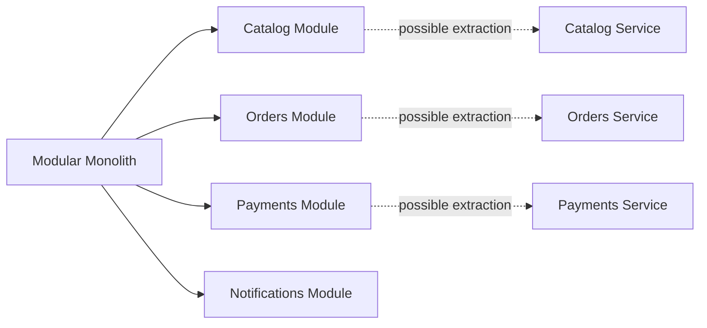

Microservices are not a badge of seniority. They are a trade-off.

That still matters because many teams keep reaching for microservices before they have the product, team structure, deployment process, and observability needed to run them well. The word sounds modern. It suggests scale, independence, cloud maturity, and serious engineering.

Sometimes that is true. Often it is not.

My default choice for a new backend, a SaaS MVP, an internal platform, or a product whose domain is still changing would usually be a modular monolith. Not a messy monolith. Not a "put everything in one service class" monolith. A single deployable application with strong internal boundaries, explicit module APIs, and enough discipline to split pieces later if the business earns that complexity.

The important question is not "monolith or microservices?". The better question is: which architecture can this team build, deploy, observe, and evolve safely right now?

[](/images/blog/modular-monolith-vs-microservices-hero.webp)

## What is a modular monolith?

A modular monolith is a single deployable application organized into clear modules around business capabilities.

It runs as one process. It is usually deployed as one unit. In many cases it has one main database, although larger systems may separate schemas or use clear ownership rules inside the same database. The key is that the code is not organized as one undifferentiated pile. Catalog, orders, payments, users, notifications, reporting, or integrations have visible boundaries.

A Java and Spring Boot inspired package structure might look like this:

```text
com.example.shop
  catalog
    application
    domain
    infrastructure
  orders
    application
    domain
    infrastructure
  payments
    application
    domain
    infrastructure
  shared
```

Each module should own its use cases, domain model, persistence adapters, and integration details as much as possible. Other modules should not casually reach into its internals.

That is the difference between a modular monolith and a big ball of mud. A modular monolith requires discipline. You still need naming, dependency rules, tests, and architecture reviews. The benefit is that you can keep most complexity inside the programming language and process boundary instead of immediately moving it to the network.

The strengths are practical:

- one deployable unit
- simpler local development
- fewer repositories and pipelines
- easier refactoring while boundaries are still evolving
- in-process calls instead of remote calls
- simpler transactions
- lower infrastructure cost
- less operational overhead for small and medium teams

This is why modular monolith vs microservices is not really a debate about fashion. It is a debate about where you want to pay the complexity bill.

## What are microservices?

Microservices are independently deployable services organized around business capabilities.

A small commerce system might be split like this:

```text
catalog-service
orders-service
payment-service
notification-service
user-service
```

In a healthy microservices architecture, each service has a clear purpose, owns its data, exposes stable APIs or events, and can be deployed independently. Teams can release a payment service without rebuilding the catalog service. A search service can scale differently from a reporting service. A notification service can process asynchronous workloads without slowing down checkout.

A typical request path may look more like this:

```text
Client
  |
API Gateway
  |
  |-- catalog-service
  |-- orders-service
  |-- payment-service
  |-- notification-service
  |-- reporting-service
```

The attraction is obvious: smaller codebases, stronger ownership, independent scaling, and independent releases.

The cost is also obvious once you run them in production: microservices move complexity from code structure into operations, networking, data consistency, monitoring, testing, deployment coordination, and team communication.

They are not just "smaller services". They are a distributed system.

## Modular monolith vs microservices

| Dimension              | Modular Monolith                                    | Microservices                                       | Practical implication                                             |
| ---------------------- | --------------------------------------------------- | --------------------------------------------------- | ----------------------------------------------------------------- |
| Deployment             | One deployable application                          | Many independently deployable services              | Microservices need stronger release discipline and compatibility  |
| Local development      | Usually one app and one main database               | Several services, dependencies, and mocks           | A monolith is easier to run locally without platform tooling      |
| Data consistency       | Transactions are simpler                            | Distributed consistency and sagas may be needed     | Product flows may need to accept eventual consistency             |
| Team autonomy          | Good with module ownership, but releases are shared | Stronger when teams own services end to end         | Autonomy matters only if teams can really deploy independently    |
| Scalability            | Scale the whole application or selected internals   | Scale services separately                           | Microservices help when parts of the system have different load   |
| Observability          | Logs and metrics are simpler to correlate           | Logs, metrics, traces, and correlation are required | Distributed tracing becomes a production need                     |
| Testing                | Unit and integration tests are more direct          | Contract and cross-service tests become important   | Testing cost rises with network boundaries                        |
| CI/CD                  | One main pipeline                                   | Many pipelines, versions, and environments          | Delivery maturity must exist before the split                     |
| Debugging              | One process and one stack trace in many cases       | Failures cross process and network boundaries       | Incidents need correlation IDs and service maps                   |
| Infrastructure cost    | Lower                                               | Higher                                              | More services usually mean more compute, tooling, and maintenance |
| Operational complexity | Lower                                               | Higher                                              | On-call work changes from app debugging to system debugging       |
| Refactoring            | Easier while boundaries are changing                | Harder once contracts and data ownership are fixed  | Premature splits make domain changes expensive                    |
| Failure isolation      | Weaker by default                                   | Stronger if designed and operated well              | Isolation is not automatic; cascading failures still happen       |
| Time to market         | Usually faster early                                | Can be faster later with mature teams               | Architecture should match the product and organization stage      |

## The hidden cost of microservices

The hidden cost of microservices is not that they are impossible. The hidden cost is that they make every boundary more explicit, more expensive, and more operational.

An in-process call becomes a network call. That means latency, timeouts, retries, partial failure, versioning, authentication, and monitoring. A method signature becomes an API contract. A thrown exception becomes an HTTP error, a failed message, or a timeout that may or may not have completed the work.

Data consistency changes too. In a monolith, creating an order and reserving stock may happen in one database transaction. In microservices, the order service and catalog service should not casually share a database. Now you need events, sagas, compensating actions, idempotency, and a product conversation about what the user sees while the system is eventually consistent.

Debugging also changes. In a monolith, a useful log line and stack trace may be enough. In microservices, you need correlation IDs, structured logs, metrics, distributed tracing, and a way to see the full request path. OpenTelemetry, logs, metrics, and traces stop being "nice to have". They become the way you understand production.

Testing becomes more expensive. You still need unit tests, but you also need API contract tests, consumer-driven contracts, integration environments, realistic test data, and backward-compatible deployments. If every feature needs changes in three repositories, local confidence gets harder.

Infrastructure expands. You may need an API gateway, Docker images, Kubernetes or another runtime, service discovery, secrets management, message brokers such as Kafka or RabbitMQ, CI/CD pipelines for each service, dashboards, alerting, retries, circuit breakers, timeouts, and a clear on-call model.

None of this is a reason to reject microservices. It is a reason to avoid pretending they are a free upgrade.

## Why modular monoliths are underrated

Modular monoliths are underrated because they do not sound as impressive in architecture meetings.

But they are often the best engineering default.

A modular monolith lets a team discover the domain before freezing service boundaries. That matters because early boundaries are usually guesses. The first model of "orders", "billing", "subscriptions", "notifications", or "customers" often changes after real users, support tickets, integrations, and reporting needs appear.

Inside a modular monolith, moving behavior between modules is still work, but it is mostly code work. Across services, the same change may involve API versions, data migration, deployment ordering, and compatibility windows.

A modular monolith can still use serious architecture:

- domain-driven design
- hexagonal architecture
- clean architecture
- clear module APIs
- internal events
- CQRS in the few places where it helps
- separate packages by business capability
- separate database schemas when useful
- dependency rules enforced by tests
- architecture tests with tools such as ArchUnit

You can build a professional Spring Boot architecture without starting with five services.



The goal is simple: start with boundaries that are cheap to change. Extract only when a boundary becomes stable and valuable enough to operate independently.

## When microservices actually make sense

Microservices make sense when the product and organization have outgrown a single deployable application in specific, measurable ways.

Good signals include:

- multiple teams need independent delivery
- domain boundaries are clear and stable
- services have different scaling needs
- one part of the system has stricter security or compliance rules
- failure isolation has business value
- the company has mature CI/CD
- observability is already strong
- each team can own a service from code to production
- services can own their data without database shortcuts
- independent deployment reduces real coordination cost

Some examples are easy to imagine.

A payment service may need stricter access controls, audit trails, idempotency, and compliance practices than the rest of the product. A notification service may process asynchronous workloads and tolerate delays that checkout cannot. A search service may need different storage, indexing, and scaling behavior. A recommendation service may use ML-specific infrastructure. A reporting service may need to protect transactional workloads from heavy analytical queries.

In those cases, microservices are not a resume-driven architecture choice. They solve a concrete organizational or technical problem.

## When microservices are a mistake

Microservices are usually a mistake when they are used to compensate for unclear thinking.

The warning signs are familiar:

- one small team owns everything
- the domain changes every week
- there are no automated tests
- deployments are manual or fragile
- observability is weak
- nobody owns services end to end
- services share the same database anyway
- every feature touches many services
- data ownership is unclear
- versioning is not handled
- the team wants microservices because they sound modern
- Kubernetes arrives before the product needs it

> **Practical warning:** Distributed architecture does not fix unclear boundaries. It makes them more expensive.

A distributed monolith is the worst version of both worlds: many deployables, shared data, synchronous call chains, coupled releases, and no real team autonomy. You pay the operational cost of microservices without getting the independence.

## A practical decision framework

Before choosing a microservices architecture, I would ask these questions:

| Question                                              | If the answer is "no"                                     |
| ----------------------------------------------------- | --------------------------------------------------------- |
| How many engineers will work on this system?          | A small team probably benefits from fewer moving parts    |
| Can we deploy independently today?                    | Microservices will add ceremony without delivery autonomy |
| Do we have clear domain boundaries?                   | Start modular and let the boundaries mature               |
| Can each service own its data?                        | Shared databases will create a distributed monolith       |
| Do we have tracing, metrics, logs, and alerting?      | Production debugging will become guesswork                |
| Can the product handle eventual consistency?          | Users may see confusing states during multi-service flows |
| Do we have automated tests and contract tests?        | Cross-service changes will be risky                       |
| Are we solving a real scaling problem?                | Scaling an imagined bottleneck is expensive speculation   |
| Is the deployment pipeline mature enough?             | Many services will multiply fragile release work          |
| Would microservices reduce bottlenecks or add queues? | Architecture may create more coordination than it removes |

Choose a modular monolith when:

- the team is small
- the product is early
- domain boundaries are unclear
- speed matters
- operational maturity is limited
- most components scale similarly
- one deployment pipeline is enough
- refactoring is still frequent

Choose microservices when:

- teams need real autonomy
- boundaries are stable
- services have different scaling, security, or reliability needs
- independent deployment creates business value
- the organization can operate distributed systems
- service ownership is clear
- data ownership can be enforced

This is the shortest version of my backend architecture recommendation: start simple, but not messy.

## Migration path: from modular monolith to microservices

The migration path I trust most is: start modular, extract later.

That does not mean ignoring future scale. It means designing the monolith so extraction is possible if it becomes valuable.

A safe path looks like this:

1. Build a modular monolith with strict boundaries.
2. Define module APIs instead of reaching into internals.
3. Keep domain logic inside the module that owns it.
4. Use internal events where they make the flow clearer.
5. Add architecture tests to enforce dependency rules.
6. Make database ownership visible, even if one physical database is used.
7. Identify modules with independent scaling or ownership needs.
8. Extract one service at a time.
9. Start with lower-risk candidates such as notifications, reporting, search, or external integrations.
10. Introduce API contracts before extraction.
11. Move data ownership carefully.
12. Add observability before extraction, not after.
13. Keep releases backward compatible.

This is close to the strangler fig idea: place a new boundary around a specific capability, route part of the work through the new path, and grow it gradually while the old path remains stable.

The mistake is trying to split everything at once. A monolith to microservices migration should feel like a sequence of boring, reversible moves. If every extraction needs a heroic release weekend, the boundary is probably not ready.

## Java and Spring Boot angle

For Java backend developers, the modular monolith is a very natural fit.

In Spring Boot, I would package by business capability, not only by technical layer. A package named `orders` should contain the order controller or input adapter, application service, domain model, repositories, persistence adapters, and integration code that belongs to orders. The module should expose a small API to the rest of the application.

Avoid shared "god" packages. A `shared` module should contain stable, boring things: common IDs, small primitives, maybe cross-cutting technical helpers. It should not become a dumping ground for business logic that nobody wants to own.

Good practices:

- keep controllers, application services, domain model, repositories, and infrastructure inside the module
- expose module boundaries through interfaces or application services
- avoid direct access to another module's repositories
- use application events carefully, not as invisible spaghetti
- keep database boundaries visible
- use ArchUnit or similar tools to enforce dependency rules
- use Testcontainers for integration tests when the database behavior matters
- keep modules independently testable

An illustrative use case might look like this:

```java
@Service
class PlaceOrderUseCase {
  private final OrderRepository orders;
  private final CatalogModule catalog;
  private final PaymentModule payments;

  public OrderId placeOrder(PlaceOrderCommand command) {
    var product = catalog.getProduct(command.productId());
    var order = Order.create(command.customerId(), product);
    payments.authorize(order.paymentRequest());
    orders.save(order);
    return order.id();
  }
}
```

This is only illustrative. In a real system, I would be careful with the shape of `CatalogModule` and `PaymentModule`, error handling, idempotency, transactions, and what happens if payment authorization succeeds but saving the order fails.

The point is that the dependency is explicit. The orders module is not importing random catalog repository internals. It talks through a boundary.

For related backend structure, see [hexagonal architecture in backend projects](/en/blog/hexagonal-architecture-what-it-is-how-to-apply-backend-projects/) and the [Spring Boot production checklist](/en/blog/spring-boot-production-devops-checklist/).

## Common anti-patterns

### The distributed monolith

Many services, one release train, shared data, and synchronized changes. This has the cost of microservices without independent delivery.

### Shared database across services

If several services freely read and write the same tables, the database is the real integration contract. Changing it becomes dangerous.

### Synchronous call chains everywhere

`client -> api -> service A -> service B -> service C -> database` is easy to draw and painful to operate. Latency and failures compound.

### One repository per service, one team owning all services

Repository count is not team autonomy. If one team owns ten services and every feature touches five of them, the split probably added overhead.

### No contract testing

If service APIs change without consumer protection, independent deployment becomes optimistic.

### No observability

Without logs, metrics, traces, and alerts, microservices turn production into guesswork.

### Premature Kubernetes

Kubernetes can be excellent. It can also become a second product your team has to operate before the first product has traction.

### Splitting by technical layer

An `auth-service`, `database-service`, and `business-logic-service` split by layer is usually not microservices. Services should follow business capabilities.

### Creating services before understanding the domain

Early service boundaries often encode early misunderstandings. A modular monolith gives you room to learn.

### Resume-driven architecture

Choosing microservices because they sound senior is one of the fastest ways to make a small product slow.

## Final recommendation

Today, I would usually start with a modular monolith for new products, startups, internal tools, SaaS MVPs, and projects where the domain is still evolving.

I would move to microservices only when the team and product have earned that complexity.

Start simple, but not messy. Design the monolith so it can be split later if the business ever needs it.

That recommendation is not nostalgia for monoliths. It is respect for operational reality. Good boundaries matter more than the number of deployables.

## Conclusion

Architecture is about trade-offs.

Microservices are powerful, but they are expensive. Modular monoliths are not outdated, but they require discipline. The best backend architecture is the one your team can build, deploy, observe, and evolve safely.

If you are building a backend system and want help choosing the right architecture, feel free to [contact me](/en/contact/).

## FAQ

**Are microservices better than a modular monolith?**

Only in the right context. Microservices help when independent deployment, scaling, ownership, or isolation creates real value. For many teams, a modular monolith is faster and safer.

**Is a modular monolith just a monolith with better folder names?**

No. Folder names are not enough. You need dependency rules, explicit module APIs, tests, and discipline around data access.

**When should a team move from monolith to microservices?**

When boundaries are stable, teams need independent delivery, services can own their data, and the organization can operate distributed systems.

**Can Spring Boot work well as a modular monolith?**

Yes. Package by business capability, keep module boundaries explicit, use architecture tests, and avoid shared god packages.

**What is the biggest microservices risk?**

Building a distributed monolith: many services that still share data, releases, and ownership.

## Sources and further reading

- Martin Fowler and James Lewis: [Microservices](https://martinfowler.com/articles/microservices.html)
- Chris Richardson: [Microservice Architecture pattern](https://microservices.io/patterns/microservices.html)
- Spring: [Spring Modulith reference documentation](https://docs.spring.io/spring-modulith/reference/)
- OpenTelemetry: [Documentation](https://opentelemetry.io/docs/)
- Related: [When should you use Kafka, RabbitMQ or just a database?](/en/blog/when-should-you-use-kafka-rabbitmq-or-just-a-database/)
- Related: [Idempotent APIs that survive retries](/en/blog/idempotent-apis-that-survive-retries/)
