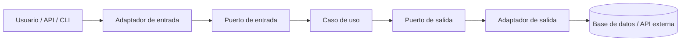

La arquitectura hexagonal suele aparecer cuando una aplicación backend empieza a crecer y el código deja de tener bordes claros.

Al principio todo parece manejable: un controlador recibe la petición, un servicio hace la operación, un repositorio guarda en base de datos y quizá se llama a una API externa. El problema llega cuando esas piezas empiezan a mezclarse. El controlador conoce demasiados detalles del caso de uso. El servicio sabe demasiado de JPA. La lógica de negocio depende de anotaciones de Spring. Cambiar una integración rompe tests que no deberían enterarse de esa integración.

La arquitectura hexagonal intenta resolver ese problema con una idea bastante concreta: la lógica importante de la aplicación debe vivir en el centro, y los detalles externos deben entrar y salir por bordes definidos.

[](/images/blog/arquitectura-hexagonal.webp)

## Qué es la arquitectura hexagonal

La arquitectura hexagonal, también conocida como arquitectura de puertos y adaptadores, organiza una aplicación alrededor de su dominio y sus casos de uso.

La idea no es dibujar un hexágono bonito. El hexágono es una forma de recordar que la aplicación puede comunicarse con varios mundos externos:

- una API REST
- una CLI
- un job programado
- una cola de eventos
- una base de datos
- una API de pagos
- un sistema de emails

En vez de dejar que esos detalles gobiernen el diseño, la aplicación define puertos. Un puerto es un contrato que expresa lo que el centro necesita o permite hacer.

Los adaptadores implementan esos contratos usando tecnología concreta.

Por ejemplo:

- un adaptador REST convierte HTTP en una llamada a un caso de uso
- un adaptador de persistencia convierte una operación de dominio en una query JPA
- un adaptador de API externa convierte una llamada del caso de uso en una petición HTTP real

El centro no debería saber si la orden llega por REST, CLI o evento. Tampoco debería saber si se guarda en PostgreSQL, MySQL o un stub en memoria durante un test.

## Qué problema resuelve

La arquitectura hexagonal ayuda cuando el backend empieza a sufrir por acoplamiento.

Los síntomas suelen ser estos:

- necesitas levantar Spring y base de datos para probar una regla de negocio sencilla
- cambiar una tabla obliga a tocar código de aplicación que no debería depender de esa tabla
- el dominio está lleno de anotaciones de JPA, Jackson o Spring
- la lógica real está repartida entre controladores, servicios y repositorios
- cada integración externa mete su propio modelo dentro del caso de uso

El objetivo no es eliminar frameworks. Spring Boot, JPA y las librerías HTTP siguen siendo útiles. El objetivo es que sean detalles de infraestructura, no el centro del diseño.

Bien aplicada, la arquitectura hexagonal mejora:

- **Testabilidad:** puedes probar casos de uso con dobles simples, sin base de datos ni servidor web.
- **Mantenibilidad:** los cambios de infraestructura quedan más localizados.
- **Claridad:** el caso de uso se lee como negocio, no como pegamento técnico.
- **Independencia de frameworks:** el dominio no necesita conocer Spring para existir.
- **Evolución:** puedes añadir otros adaptadores sin reescribir la lógica central.

También añade estructura. No es gratis. Si el proyecto es un CRUD pequeño sin reglas relevantes, puede ser demasiada ceremonia.

## Partes principales de la arquitectura hexagonal

### Dominio

El dominio contiene las reglas importantes del negocio.

Aquí deberían vivir entidades, value objects, políticas y validaciones que tienen sentido aunque mañana cambies Spring Boot por otro framework.

En una app de pedidos, el dominio podría contener `Order`, `OrderLine`, `Money`, `CustomerId` o reglas como "una orden no puede crearse sin líneas".

El dominio no debería depender de:

- `@Entity`
- `@RestController`
- `JpaRepository`
- DTOs de API externa
- clases de configuración de Spring

### Casos de uso / capa de aplicación

La capa de aplicación coordina una operación concreta.

Ejemplos:

- crear una orden
- registrar un usuario
- cancelar una suscripción
- consultar disponibilidad de producto
- guardar una apuesta

Un caso de uso no debería estar lleno de detalles de HTTP ni SQL. Su trabajo es orquestar el flujo:

1. validar la entrada del caso de uso
2. cargar datos necesarios
3. ejecutar reglas del dominio
4. guardar cambios
5. devolver una respuesta útil

### Puertos de entrada

Los puertos de entrada definen qué puede hacer la aplicación desde fuera.

En Java suelen ser interfaces como:

```java
public interface CreateOrderUseCase {
  OrderId create(CreateOrderCommand command);
}
```

El adaptador REST, una CLI o un consumidor de eventos pueden llamar al mismo puerto de entrada.

### Puertos de salida

Los puertos de salida definen qué necesita la aplicación del exterior.

Por ejemplo:

```java
public interface OrderRepository {
  Order save(Order order);
}
```

El caso de uso depende de esa interfaz. La implementación concreta puede usar JPA, JDBC, MongoDB, una API externa o memoria para tests.

### Adaptadores de entrada

Los adaptadores de entrada traducen un mecanismo externo a una llamada del caso de uso.

Ejemplos:

- controlador REST
- comando CLI
- handler de eventos
- job programado
- GraphQL resolver

Aquí sí tiene sentido usar anotaciones de Spring MVC, validaciones de request, DTOs HTTP y códigos de estado.

### Adaptadores de salida

Los adaptadores de salida implementan puertos que el caso de uso necesita.

Ejemplos:

- repositorio JPA
- cliente HTTP para una API externa
- publicador de eventos
- adaptador de email
- adaptador de almacenamiento de archivos

Aquí viven los detalles feos: SQL, entidades JPA, clientes HTTP, retries, timeouts, mapeos y errores de infraestructura.

### Infraestructura

La infraestructura conecta todo.

En Spring Boot suele incluir configuración, beans, seguridad, transacciones, clientes HTTP, mappers técnicos y propiedades de entorno.

La regla práctica: si algo existe porque usas una tecnología concreta, probablemente pertenece a infraestructura o a un adaptador.

<!-- Imagen sugerida: diagrama visual de puertos y adaptadores -->

## Ejemplo de estructura de carpetas en Java Spring Boot

Una estructura sencilla podría quedar así:

```text
src/main/java/com/example/app/
  domain/
    model/
    policy/
  application/
    port/
      in/
      out/
    service/
  adapter/
    in/
      web/
      cli/
    out/
      persistence/
      externalapi/
  config/
```

No hay una única estructura correcta. Lo importante es que las dependencias apunten hacia dentro.

Una regla útil:

- `domain` no depende de nadie
- `application` depende de `domain`
- `adapter` depende de `application` y `domain`
- `config` conecta implementaciones concretas

Si desde `domain` importas `org.springframework`, algo se ha torcido.

## Ejemplo práctico: crear una orden

Vamos con un caso pequeño: una API crea una orden con varias líneas y la guarda.

No voy a meter todo el código de una app real. La idea es ver los bordes.

### Modelo de dominio

```java
package com.example.app.domain.model;

import java.math.BigDecimal;
import java.util.List;
import java.util.UUID;

public class Order {
  private final UUID id;
  private final List<OrderLine> lines;

  private Order(UUID id, List<OrderLine> lines) {
    if (lines == null || lines.isEmpty()) {
      throw new IllegalArgumentException("An order needs at least one line");
    }
    this.id = id;
    this.lines = List.copyOf(lines);
  }

  public static Order create(List<OrderLine> lines) {
    return new Order(UUID.randomUUID(), lines);
  }

  public UUID id() {
    return id;
  }

  public BigDecimal total() {
    return lines.stream()
      .map(OrderLine::subtotal)
      .reduce(BigDecimal.ZERO, BigDecimal::add);
  }
}
```

```java
package com.example.app.domain.model;

import java.math.BigDecimal;

public record OrderLine(String productId, int quantity, BigDecimal unitPrice) {
  public OrderLine {
    if (quantity <= 0) {
      throw new IllegalArgumentException("Quantity must be positive");
    }
  }

  public BigDecimal subtotal() {
    return unitPrice.multiply(BigDecimal.valueOf(quantity));
  }
}
```

El dominio no conoce REST, JSON, JPA ni Spring. Solo expresa reglas.

### Puerto de entrada

```java
package com.example.app.application.port.in;

import java.math.BigDecimal;
import java.util.List;
import java.util.UUID;

public interface CreateOrderUseCase {
  UUID create(CreateOrderCommand command);

  record CreateOrderCommand(List<Line> lines) {
    public record Line(String productId, int quantity, BigDecimal unitPrice) {
    }
  }
}
```

Este contrato dice qué operación ofrece la aplicación. No dice si llega por HTTP o por otro canal.

### Puerto de salida

```java
package com.example.app.application.port.out;

import com.example.app.domain.model.Order;

public interface SaveOrderPort {
  Order save(Order order);
}
```

El caso de uso necesita guardar órdenes, pero no necesita conocer JPA.

### Caso de uso

```java
package com.example.app.application.service;

import com.example.app.application.port.in.CreateOrderUseCase;
import com.example.app.application.port.out.SaveOrderPort;
import com.example.app.domain.model.Order;
import com.example.app.domain.model.OrderLine;
import java.util.UUID;

public class CreateOrderService implements CreateOrderUseCase {
  private final SaveOrderPort saveOrderPort;

  public CreateOrderService(SaveOrderPort saveOrderPort) {
    this.saveOrderPort = saveOrderPort;
  }

  @Override
  public UUID create(CreateOrderCommand command) {
    var lines = command.lines().stream()
      .map(line -> new OrderLine(
        line.productId(),
        line.quantity(),
        line.unitPrice()
      ))
      .toList();

    Order order = Order.create(lines);
    return saveOrderPort.save(order).id();
  }
}
```

El caso de uso coordina. No sabe si la petición viene de un controlador REST. No sabe si la persistencia usa JPA. Eso queda fuera.

### Adaptador REST de entrada

```java
package com.example.app.adapter.in.web;

import com.example.app.application.port.in.CreateOrderUseCase;
import java.math.BigDecimal;
import java.util.List;
import java.util.UUID;
import org.springframework.http.HttpStatus;
import org.springframework.web.bind.annotation.PostMapping;
import org.springframework.web.bind.annotation.RequestBody;
import org.springframework.web.bind.annotation.ResponseStatus;
import org.springframework.web.bind.annotation.RestController;

@RestController
class CreateOrderController {
  private final CreateOrderUseCase createOrderUseCase;

  CreateOrderController(CreateOrderUseCase createOrderUseCase) {
    this.createOrderUseCase = createOrderUseCase;
  }

  @PostMapping("/orders")
  @ResponseStatus(HttpStatus.CREATED)
  CreateOrderResponse create(@RequestBody CreateOrderRequest request) {
    UUID orderId = createOrderUseCase.create(request.toCommand());
    return new CreateOrderResponse(orderId);
  }

  record CreateOrderRequest(List<LineRequest> lines) {
    CreateOrderUseCase.CreateOrderCommand toCommand() {
      return new CreateOrderUseCase.CreateOrderCommand(
        lines.stream()
          .map(line -> new CreateOrderUseCase.CreateOrderCommand.Line(
            line.productId(),
            line.quantity(),
            line.unitPrice()
          ))
          .toList()
      );
    }
  }

  record LineRequest(String productId, int quantity, BigDecimal unitPrice) {
  }

  record CreateOrderResponse(UUID orderId) {
  }
}
```

El controlador habla HTTP. Traduce request a comando. Nada más.

### Adaptador de persistencia de salida

```java
package com.example.app.adapter.out.persistence;

import com.example.app.application.port.out.SaveOrderPort;
import com.example.app.domain.model.Order;
import org.springframework.stereotype.Repository;

@Repository
class JpaOrderPersistenceAdapter implements SaveOrderPort {
  private final SpringDataOrderRepository repository;
  private final OrderPersistenceMapper mapper;

  JpaOrderPersistenceAdapter(
    SpringDataOrderRepository repository,
    OrderPersistenceMapper mapper
  ) {
    this.repository = repository;
    this.mapper = mapper;
  }

  @Override
  public Order save(Order order) {
    OrderEntity saved = repository.save(mapper.toEntity(order));
    return mapper.toDomain(saved);
  }
}
```

```java
package com.example.app.adapter.out.persistence;

import java.util.UUID;
import org.springframework.data.jpa.repository.JpaRepository;

interface SpringDataOrderRepository extends JpaRepository<OrderEntity, UUID> {
}
```

Aquí sí aparece Spring Data JPA. Está bien: este adaptador pertenece a infraestructura.

En una aplicación real también tendrías `OrderEntity`, mappers, migraciones, manejo de errores y quizá transacciones. La clave es que todo eso no contamine el dominio.

## Diagrama Mermaid



El flujo es más importante que el dibujo: las dependencias del caso de uso apuntan a interfaces propias, no a detalles externos.

## Arquitectura hexagonal vs arquitectura en capas

| Aspecto                 | Arquitectura en capas                                                             | Arquitectura hexagonal                                                                           |
| ----------------------- | --------------------------------------------------------------------------------- | ------------------------------------------------------------------------------------------------ |
| Organización            | Suele separar controller, service, repository e infraestructura por capa técnica. | Separa dominio, casos de uso, puertos y adaptadores alrededor del negocio.                       |
| Dependencias            | A menudo bajan desde controlador hacia repositorio y framework.                   | Apuntan hacia dentro; los detalles implementan contratos del centro.                             |
| Testabilidad            | Puede requerir levantar más infraestructura si la lógica está mezclada.           | Facilita tests de casos de uso con adaptadores falsos o en memoria.                              |
| Relación con frameworks | El framework puede acabar marcando la forma del código.                           | El framework vive en adaptadores y configuración.                                                |
| Complejidad inicial     | Más simple de empezar en CRUDs pequeños.                                          | Más estructura desde el primer día.                                                              |
| Casos donde conviene    | Apps simples, prototipos, paneles CRUD con poca lógica.                           | Backends con reglas de negocio, integraciones, varios canales de entrada o crecimiento previsto. |

<!-- Imagen sugerida: comparación entre arquitectura en capas y arquitectura hexagonal -->

No hace falta tratar la arquitectura en capas como un error. En muchos proyectos funciona. El problema aparece cuando la capa de servicio se convierte en una mezcla de negocio, SQL, HTTP, DTOs externos y decisiones de framework.

## Errores comunes al aplicarla

### Crear demasiadas interfaces innecesarias

No todo necesita una interfaz.

Una interfaz tiene sentido cuando marca un borde real:

- entrada a un caso de uso
- salida hacia infraestructura
- colaboración que quieres sustituir en tests
- integración que puede cambiar

Crear `UserService`, `UserServiceImpl`, `UserManager`, `UserFacade` y `UserPort` para una operación trivial no es arquitectura. Es ruido.

### Meter lógica de negocio en los adaptadores

El adaptador REST no debería decidir si una orden es válida por reglas de negocio. Puede validar formato, campos obligatorios y errores HTTP. La regla importante debería vivir en dominio o aplicación.

Lo mismo con persistencia: un mapper JPA no debería decidir descuentos, estados o límites de negocio.

### Confundir entidades JPA con dominio

A veces una entidad JPA puede parecerse mucho al modelo de dominio. Aun así, no son lo mismo por defecto.

Una entidad JPA está condicionada por persistencia:

- constructor vacío
- proxies
- relaciones lazy
- anotaciones
- restricciones de tabla
- comportamiento del ORM

El dominio debería modelar reglas. Si mezclar ambas cosas complica el código o los tests, sepáralas.

### Sobrediseñar proyectos pequeños

Si estás haciendo un prototipo de dos pantallas o un CRUD administrativo sin lógica real, una arquitectura hexagonal completa puede ser excesiva.

Empieza simple. Extrae puertos cuando aparezca un borde real.

### Pensar que todo debe tener un puerto

Un puerto no es una decoración. Es un contrato.

No necesitas un puerto para cada clase. Necesitas puertos donde la aplicación cruza un límite: entrada externa, persistencia, APIs externas, eventos, reloj del sistema, generación de IDs si importa para tests, etc.

### Depender de Spring dentro del dominio

Esta es una de las señales más fáciles de detectar.

Si una clase de dominio necesita `@Autowired`, `@Component`, `ApplicationEventPublisher` o `Environment`, el dominio ya no es independiente.

Puedes usar Spring para construir objetos y conectar dependencias. Pero el dominio no debería necesitar Spring para explicar sus reglas.

## Cuándo merece la pena usar arquitectura hexagonal

La arquitectura hexagonal merece la pena cuando hay algo que proteger.

Suele encajar bien si:

- hay lógica de negocio importante
- el proyecto integra APIs externas
- quieres testear casos de uso sin infraestructura
- el backend puede crecer durante años
- hay varios adaptadores: REST, CLI, jobs, eventos, webhooks
- necesitas cambiar persistencia o proveedores externos con menos dolor
- el equipo se pierde entre controladores, servicios y repositorios demasiado grandes

En esos casos, los puertos y adaptadores no son teoría. Son una forma de evitar que cada detalle técnico se meta en el centro.

También encaja bien con Spring Boot si lo usas con disciplina. Spring puede vivir en los adaptadores y en `config`, mientras el dominio y buena parte de la aplicación siguen siendo Java normal.

Si estás diseñando una API que va a producción, este enfoque conecta bien con temas como [APIs idempotentes](/es/blog/apis-idempotentes-que-sobreviven-a-reintentos/), [Spring Boot en producción](/es/blog/spring-boot-produccion-checklist-devops/) y un servicio de [backend con Spring Boot](/es/services/backend-spring-boot/).

## Cuándo no merece la pena

No usaría arquitectura hexagonal completa para todo.

Puede ser excesiva en:

- CRUDs muy simples
- prototipos que se van a tirar
- proyectos sin lógica de negocio
- scripts internos de vida corta
- aplicaciones donde el coste de la estructura supera el coste del cambio

La señal práctica es esta: si pasas más tiempo creando carpetas, interfaces y mappers que resolviendo reglas reales, probablemente te has adelantado.

Puedes aplicar una versión ligera:

- mantener el dominio sin Spring
- aislar integraciones externas
- probar casos de uso importantes
- separar DTOs HTTP de modelos internos

No hace falta activar toda la ceremonia desde el primer commit.

## Conclusión

La arquitectura hexagonal no debería usarse por moda.

Su valor aparece cuando ayuda a proteger el dominio, probar casos de uso sin infraestructura y mantener los detalles técnicos en su sitio. En un backend Java con Spring Boot, eso suele traducirse en algo muy concreto: controladores delgados, casos de uso legibles, puertos de salida para dependencias externas y adaptadores que absorben el ruido de JPA, HTTP o cualquier proveedor.

Si el proyecto tiene reglas importantes y va a crecer, la arquitectura hexagonal puede ahorrarte bastante dolor. Si solo estás montando un CRUD pequeño, quizá basta con una estructura más simple y disciplina básica.

La pregunta no es "¿puedo aplicar arquitectura hexagonal aquí?". La pregunta útil es: "¿qué parte del negocio necesito proteger de los detalles externos?".

## FAQ

**¿Arquitectura hexagonal y Clean Architecture son lo mismo?**  
No son exactamente lo mismo, aunque comparten ideas: dependencias hacia dentro, dominio protegido y detalles externos en los bordes. Clean Architecture define capas y reglas con otro vocabulario. La arquitectura hexagonal habla sobre todo de puertos y adaptadores.

**¿Puedo usar arquitectura hexagonal con Spring Boot?**  
Sí. De hecho, Spring Boot encaja bien si mantienes las anotaciones y beans en adaptadores, configuración e infraestructura. El dominio no necesita conocer Spring.

**¿Dónde van los repositorios?**  
Depende de qué llames repositorio. El puerto de salida, por ejemplo `SaveOrderPort`, suele vivir en `application/port/out`. La implementación con Spring Data JPA vive en `adapter/out/persistence`.

**¿El dominio debe conocer Spring?**  
No debería. El dominio debería poder probarse como Java normal. Si necesita Spring para ejecutar una regla, probablemente hay acoplamiento innecesario.

**¿Merece la pena en proyectos pequeños?**  
A veces no. En proyectos pequeños con poca lógica, una estructura por capas puede ser suficiente. Lo razonable es aplicar los principios que aporten valor sin llenar el proyecto de interfaces prematuras.

## Fuentes y verificación

- Alistair Cockburn: Hexagonal Architecture — https://alistair.cockburn.us/hexagonal-architecture
- Spring Framework: Dependency Injection — https://docs.spring.io/spring-framework/reference/core/beans/dependencies/factory-collaborators.html
- Spring Data JPA reference — https://docs.spring.io/spring-data/jpa/docs/current/reference/html/
