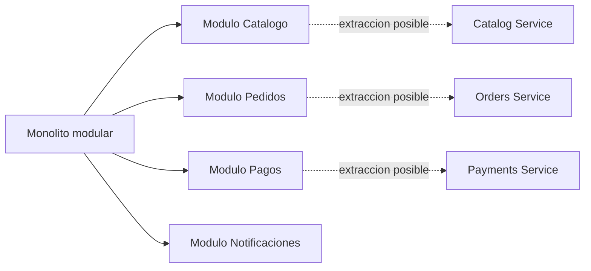

Los microservicios no son una medalla de seniority. Son una decisión con coste.

La discusión sigue siendo relevante porque muchos equipos quieren microservicios antes de tener el producto, el equipo, el proceso de despliegue y la observabilidad necesarios para operarlos bien. La palabra suena moderna. Sugiere escala, autonomía, cloud, enterprise y madurez técnica.

A veces todo eso es cierto. Muchas otras veces no.

Mi elección por defecto para un backend nuevo, un MVP SaaS, una plataforma interna o un producto cuyo dominio todavía cambia sería normalmente un monolito modular. No un monolito desordenado. No una aplicación donde todo vive en una clase `Service`. Un único despliegue con límites internos claros, APIs de módulo explícitas y suficiente disciplina para separar piezas más adelante si el negocio lo necesita.

La pregunta importante no es "¿monolito o microservicios?". La pregunta útil es: ¿qué arquitectura puede construir, desplegar, observar y evolucionar este equipo de forma segura ahora mismo?

[](/images/blog/modular-monolith-vs-microservices-hero.webp)

## Qué es un monolito modular

Un monolito modular es una aplicación desplegable como una sola unidad, organizada en módulos claros alrededor de capacidades de negocio.

Corre en un único proceso. Normalmente se despliega como una unidad. En muchos casos tiene una base de datos principal, aunque en sistemas más grandes puede haber esquemas separados o reglas claras de propiedad dentro de la misma base de datos. La clave es que el código no sea una masa indiferenciada. Catálogo, pedidos, pagos, usuarios, notificaciones, reporting o integraciones tienen límites visibles.

Una estructura inspirada en Java y Spring Boot podría ser:

```text
com.example.shop
  catalog
    application
    domain
    infrastructure
  orders
    application
    domain
    infrastructure
  payments
    application
    domain
    infrastructure
  shared
```

Cada módulo debería poseer sus casos de uso, modelo de dominio, adaptadores de persistencia y detalles de integración en la medida de lo posible. Otros módulos no deberían entrar libremente en sus clases internas.

Esa es la diferencia entre un monolito modular y un "big ball of mud". Un monolito modular exige disciplina. Sigues necesitando nombres claros, reglas de dependencia, tests y revisiones de arquitectura. La ventaja es que mantienes gran parte de la complejidad dentro del lenguaje y del proceso, en vez de moverla demasiado pronto a la red.

Sus ventajas son bastante concretas:

- una sola unidad desplegable
- desarrollo local más sencillo
- menos repositorios y pipelines
- refactorización más fácil mientras los límites evolucionan
- llamadas en memoria en vez de llamadas remotas
- transacciones más simples
- menor coste de infraestructura
- menos carga operativa para equipos pequeños y medianos

Por eso el debate monolito modular vs microservicios no va de modas. Va de dónde quieres pagar la complejidad.

## Qué son los microservicios

Los microservicios son servicios desplegables de forma independiente, organizados alrededor de capacidades de negocio.

Un sistema pequeño de comercio podría separarse así:

```text
catalog-service
orders-service
payment-service
notification-service
user-service
```

En una buena arquitectura de microservicios, cada servicio tiene un propósito claro, posee sus datos, expone APIs o eventos estables y puede desplegarse de forma independiente. El equipo puede publicar cambios en pagos sin reconstruir catálogo. Un servicio de búsqueda puede escalar distinto a uno de reporting. Un servicio de notificaciones puede procesar trabajo asíncrono sin ralentizar checkout.

Una ruta de petición típica podría verse así:

```text
Cliente
  |
API Gateway
  |
  |-- catalog-service
  |-- orders-service
  |-- payment-service
  |-- notification-service
  |-- reporting-service
```

El atractivo es evidente: bases de código más pequeñas, ownership más claro, escalado independiente y releases independientes.

El coste también aparece rápido en producción: los microservicios mueven complejidad desde la estructura del código hacia operación, red, consistencia de datos, monitorización, testing, coordinación de despliegues y comunicación entre equipos.

No son simplemente "servicios más pequeños". Son un sistema distribuido.

## Monolito modular vs microservicios

| Dimensión                | Monolito modular                                        | Microservicios                                        | Implicación práctica                                                |
| ------------------------ | ------------------------------------------------------- | ----------------------------------------------------- | ------------------------------------------------------------------- |
| Despliegue               | Una aplicación desplegable                              | Muchos servicios desplegables de forma independiente  | Los microservicios exigen releases compatibles y más disciplina     |
| Desarrollo local         | Normalmente una app y una base de datos principal       | Varios servicios, dependencias y mocks                | El monolito suele ser más fácil de levantar en local                |
| Consistencia de datos    | Las transacciones son más simples                       | Pueden aparecer sagas y consistencia distribuida      | Algunos flujos de producto tendrán consistencia eventual            |
| Autonomía de equipos     | Buena con ownership por módulo, pero release compartido | Mayor si cada equipo opera sus servicios end to end   | La autonomía solo existe si se despliega de verdad por separado     |
| Escalabilidad            | Escalas la aplicación completa o internals concretos    | Escalas servicios por separado                        | Microservicios ayudan cuando la carga no es uniforme                |
| Observabilidad           | Logs y métricas son más fáciles de correlacionar        | Logs, métricas, trazas y correlación son obligatorios | El tracing distribuido deja de ser opcional                         |
| Testing                  | Tests unitarios e integración más directos              | Contratos e integración entre servicios importan      | El coste de testing sube con cada límite de red                     |
| CI/CD                    | Un pipeline principal                                   | Muchos pipelines, versiones y entornos                | La madurez de entrega debe existir antes de separar                 |
| Debugging                | A menudo un proceso y un stack trace                    | Los fallos cruzan procesos y red                      | Los incidentes necesitan correlation IDs y mapas de servicios       |
| Coste de infraestructura | Menor                                                   | Mayor                                                 | Más servicios suelen traer más compute, tooling y mantenimiento     |
| Complejidad operativa    | Menor                                                   | Mayor                                                 | La guardia pasa de depurar una app a depurar un sistema             |
| Refactorización          | Más fácil mientras los límites cambian                  | Más difícil con contratos y datos ya fijados          | Separar demasiado pronto encarece cambios de dominio                |
| Aislamiento de fallos    | Más débil por defecto                                   | Más fuerte si está bien diseñado y operado            | El aislamiento no es automático; también hay fallos en cascada      |
| Time to market           | Normalmente más rápido al principio                     | Puede ser más rápido con equipos maduros              | La arquitectura debe seguir la etapa del producto y la organización |

## El coste oculto de los microservicios

El coste oculto de los microservicios no es que sean imposibles. El coste es que cada límite se vuelve más explícito, más caro y más operativo.

Una llamada en memoria se convierte en una llamada de red. Eso implica latencia, timeouts, reintentos, fallos parciales, versionado, autenticación y monitorización. Una firma de método se convierte en un contrato de API. Una excepción pasa a ser un error HTTP, un mensaje fallido o un timeout que quizá completó el trabajo y quizá no.

La consistencia de datos también cambia. En un monolito, crear un pedido y reservar stock puede ocurrir en una sola transacción de base de datos. En microservicios, el servicio de pedidos y el de catálogo no deberían compartir alegremente la misma base de datos. Ahora entran eventos, sagas, acciones compensatorias, idempotencia y una conversación de producto sobre qué ve el usuario mientras el sistema es eventualmente consistente.

La depuración cambia igual. En un monolito, un buen log y un stack trace pueden bastar. En microservicios necesitas correlation IDs, logs estructurados, métricas, tracing distribuido y una forma de ver el recorrido completo de una petición. OpenTelemetry, logs, métricas y trazas dejan de ser "algo deseable". Son la forma de entender producción.

El testing se encarece. Sigues necesitando tests unitarios, pero además necesitas contract testing, consumer-driven contracts, entornos de integración, datos de prueba realistas y despliegues compatibles hacia atrás. Si cada funcionalidad toca tres repositorios, ganar confianza en local se vuelve más difícil.

La infraestructura crece. Puede aparecer un API gateway, imágenes Docker, Kubernetes u otro runtime, service discovery, gestión de secretos, brokers como Kafka o RabbitMQ, pipelines de CI/CD por servicio, dashboards, alertas, reintentos, circuit breakers, timeouts y un modelo claro de guardias.

Nada de esto significa que haya que rechazar microservicios. Significa que no conviene venderlos como una mejora gratis.

## Por qué los monolitos modulares están infravalorados

Los monolitos modulares están infravalorados porque no suenan tan impresionantes en una reunión de arquitectura.

Pero muchas veces son la mejor opción de ingeniería.

Un monolito modular permite descubrir el dominio antes de congelar límites de servicio. Eso importa porque los primeros límites suelen ser hipótesis. La primera idea de "pedidos", "facturación", "suscripciones", "notificaciones" o "clientes" cambia cuando llegan usuarios reales, tickets de soporte, integraciones y necesidades de reporting.

Dentro de un monolito modular, mover comportamiento entre módulos sigue teniendo coste, pero es principalmente trabajo de código. Entre servicios, el mismo cambio puede requerir versiones de API, migración de datos, orden de despliegue y ventanas de compatibilidad.

Un monolito modular puede usar buena arquitectura:

- domain-driven design
- arquitectura hexagonal
- clean architecture
- APIs de módulo claras
- eventos internos
- CQRS en los sitios concretos donde aporta valor
- paquetes separados por capacidad de negocio
- esquemas de base de datos separados cuando tenga sentido
- reglas de dependencia verificadas por tests
- tests de arquitectura con herramientas como ArchUnit

Puedes construir una arquitectura Spring Boot profesional sin empezar con cinco servicios.



El objetivo es sencillo: empezar con límites baratos de cambiar. Extraer solo cuando un límite sea estable y valioso como para operarlo de forma independiente.

## Cuándo sí tienen sentido los microservicios

Los microservicios tienen sentido cuando el producto y la organización han superado una única aplicación desplegable de formas concretas y medibles.

Buenas señales:

- varios equipos necesitan entregar de forma independiente
- los límites de dominio están claros y son estables
- los servicios tienen necesidades de escalado distintas
- una parte del sistema requiere más seguridad o cumplimiento normativo
- el aislamiento de fallos tiene valor de negocio
- la empresa tiene CI/CD maduro
- la observabilidad ya es fuerte
- cada equipo puede operar sus servicios de código a producción
- cada servicio puede poseer sus datos sin atajos de base de datos
- el despliegue independiente reduce coordinación real

Los ejemplos son fáciles de ver.

Un servicio de pagos puede necesitar controles de acceso, auditoría, idempotencia y prácticas de cumplimiento más estrictas que el resto del producto. Un servicio de notificaciones puede procesar cargas asíncronas y tolerar retrasos que checkout no puede tolerar. Un servicio de búsqueda puede necesitar otro almacenamiento, indexación y escalado. Un servicio de recomendaciones puede usar infraestructura específica de ML. Un servicio de reporting puede proteger las cargas transaccionales frente a consultas analíticas pesadas.

En esos casos, los microservicios no son una elección para adornar el CV. Resuelven un problema técnico u organizativo real.

## Cuándo los microservicios son un error

Los microservicios suelen ser un error cuando se usan para compensar falta de claridad.

Las señales de alerta se repiten:

- un equipo pequeño lo mantiene todo
- el dominio cambia cada semana
- no hay tests automatizados
- los despliegues son manuales o frágiles
- la observabilidad es débil
- nadie posee servicios end to end
- los servicios comparten la misma base de datos
- cada funcionalidad toca muchos servicios
- la propiedad de datos no está clara
- el versionado no está resuelto
- el equipo quiere microservicios porque suenan modernos
- Kubernetes llega antes de que el producto lo necesite

> **Aviso práctico:** Una arquitectura distribuida no arregla límites poco claros. Los hace más caros.

Un monolito distribuido es la peor versión de ambos mundos: muchos desplegables, datos compartidos, cadenas síncronas, releases acopladas y ninguna autonomía real. Pagas el coste operativo de los microservicios sin obtener independencia.

## Un framework práctico de decisión

Antes de elegir una arquitectura de microservicios, yo haría estas preguntas:

| Pregunta                                              | Si la respuesta es "no"                                 |
| ----------------------------------------------------- | ------------------------------------------------------- |
| ¿Cuántos ingenieros trabajarán en este sistema?       | Un equipo pequeño suele ganar con menos piezas          |
| ¿Podemos desplegar de forma independiente hoy?        | Los microservicios añadirán ceremonia sin autonomía     |
| ¿Tenemos límites de dominio claros?                   | Empieza modular y deja que los límites maduren          |
| ¿Puede cada servicio poseer sus datos?                | Una base compartida creará un monolito distribuido      |
| ¿Tenemos trazas, métricas, logs y alertas?            | Depurar producción se convertirá en adivinanza          |
| ¿El producto puede aceptar consistencia eventual?     | El usuario puede ver estados intermedios confusos       |
| ¿Tenemos tests automatizados y contract tests?        | Los cambios entre servicios serán arriesgados           |
| ¿Resolvemos un problema real de escalado?             | Escalar un cuello de botella imaginario sale caro       |
| ¿El pipeline de despliegue es suficientemente maduro? | Muchos servicios multiplicarán releases frágiles        |
| ¿Reducen bottlenecks o añaden coordinación?           | La arquitectura puede crear más colas humanas que antes |

Elige un monolito modular cuando:

- el equipo es pequeño
- el producto está en fase temprana
- los límites del dominio no están claros
- la velocidad importa
- la madurez operativa es limitada
- la mayoría de componentes escalan de forma parecida
- un pipeline de despliegue es suficiente
- la refactorización todavía es frecuente

Elige microservicios cuando:

- los equipos necesitan autonomía real
- los límites son estables
- hay servicios con necesidades distintas de escalado, seguridad o fiabilidad
- el despliegue independiente crea valor de negocio
- la organización puede operar sistemas distribuidos
- el ownership de servicios está claro
- la propiedad de datos se puede hacer cumplir

Mi resumen de arquitectura backend sería este: empieza simple, pero no desordenado.

## Ruta de migración: de monolito a microservicios

La ruta que más confianza me da es: empieza modular, extrae después.

Eso no significa ignorar la escala futura. Significa diseñar el monolito para que la extracción sea posible si llega a aportar valor.

Un camino razonable:

1. Construye un monolito modular con límites estrictos.
2. Define APIs de módulo en vez de acceder a internals.
3. Mantén la lógica de dominio dentro del módulo que la posee.
4. Usa eventos internos cuando hagan el flujo más claro.
5. Añade tests de arquitectura para reforzar reglas de dependencia.
6. Haz visible la propiedad de datos, aunque uses una sola base física.
7. Identifica módulos con necesidades independientes de escalado u ownership.
8. Extrae un servicio cada vez.
9. Empieza por candidatos de menor riesgo: notificaciones, reporting, búsqueda o integraciones externas.
10. Introduce contratos de API antes de extraer.
11. Mueve la propiedad de datos con cuidado.
12. Añade observabilidad antes de la extracción, no después.
13. Mantén releases compatibles hacia atrás.

Esto se parece a la idea de strangler fig: rodeas una capacidad concreta con un nuevo límite, enrutas parte del trabajo por el nuevo camino y lo haces crecer gradualmente mientras el camino antiguo sigue estable.

El error es querer separarlo todo a la vez. Una migración de monolito a microservicios debería sentirse como una secuencia de pasos aburridos y reversibles. Si cada extracción necesita un fin de semana heroico de release, probablemente ese límite no está listo.

## El ángulo Java y Spring Boot

Para desarrolladores backend Java, el monolito modular encaja muy bien.

En Spring Boot, yo empaquetaría por capacidad de negocio, no solo por capa técnica. Un paquete `orders` debería contener el controlador o adaptador de entrada, servicio de aplicación, modelo de dominio, repositorios, adaptadores de persistencia y código de integración que pertenezca a pedidos. El módulo debería exponer una API pequeña al resto de la aplicación.

Evita los paquetes `shared` gigantes. Un módulo compartido debería contener cosas estables y aburridas: IDs comunes, pequeños tipos primitivos, quizá helpers técnicos transversales. No debería convertirse en un cajón para lógica de negocio que nadie quiere poseer.

Buenas prácticas:

- mantener controladores, servicios de aplicación, dominio, repositorios e infraestructura dentro del módulo
- exponer límites de módulo mediante interfaces o servicios de aplicación
- evitar acceso directo a repositorios de otro módulo
- usar eventos de aplicación con cuidado, no como spaghetti invisible
- mantener visibles los límites de base de datos
- usar ArchUnit o herramientas similares para reforzar dependencias
- usar Testcontainers para integración cuando el comportamiento de base de datos importe
- mantener módulos testeables de forma independiente

Un caso de uso ilustrativo podría ser:

```java
@Service
class PlaceOrderUseCase {
  private final OrderRepository orders;
  private final CatalogModule catalog;
  private final PaymentModule payments;

  public OrderId placeOrder(PlaceOrderCommand command) {
    var product = catalog.getProduct(command.productId());
    var order = Order.create(command.customerId(), product);
    payments.authorize(order.paymentRequest());
    orders.save(order);
    return order.id();
  }
}
```

Esto es solo ilustrativo. En un sistema real cuidaría mucho la forma de `CatalogModule` y `PaymentModule`, el manejo de errores, la idempotencia, las transacciones y qué ocurre si la autorización de pago funciona pero guardar el pedido falla.

La idea es que la dependencia sea explícita. El módulo de pedidos no importa repositorios internos de catálogo. Habla a través de un límite.

Para profundizar en estructura backend, puedes leer [arquitectura hexagonal en proyectos backend](/es/blog/arquitectura-hexagonal-que-es-como-aplicarla-proyectos-backend/) y el [checklist de Spring Boot en producción](/es/blog/spring-boot-produccion-checklist-devops/).

## Antipatrones comunes

### El monolito distribuido

Muchos servicios, un único tren de release, datos compartidos y cambios sincronizados. Tiene el coste de los microservicios sin entrega independiente.

### Base de datos compartida entre servicios

Si varios servicios leen y escriben libremente las mismas tablas, la base de datos es el contrato real de integración. Cambiarla se vuelve peligroso.

### Cadenas síncronas por todas partes

`cliente -> api -> servicio A -> servicio B -> servicio C -> base de datos` es fácil de dibujar y doloroso de operar. La latencia y los fallos se acumulan.

### Un repositorio por servicio, un solo equipo para todo

El número de repositorios no da autonomía. Si un equipo mantiene diez servicios y cada funcionalidad toca cinco, la separación probablemente añadió sobrecarga.

### Sin contract testing

Si las APIs cambian sin proteger consumidores, el despliegue independiente se convierte en optimismo.

### Sin observabilidad

Sin logs, métricas, trazas y alertas, los microservicios convierten producción en una adivinanza.

### Kubernetes prematuro

Kubernetes puede ser excelente. También puede convertirse en un segundo producto que el equipo tiene que operar antes de que el primero tenga tracción.

### Separar por capa técnica

Un `auth-service`, `database-service` y `business-logic-service` separados por capas no suelen ser microservicios. Los servicios deberían seguir capacidades de negocio.

### Crear servicios antes de entender el dominio

Los límites tempranos suelen codificar malentendidos tempranos. Un monolito modular te deja aprender.

### Arquitectura guiada por CV

Elegir microservicios porque suenan senior es una de las formas más rápidas de volver lento un producto pequeño.

## Recomendación final

Hoy, normalmente empezaría con un monolito modular para productos nuevos, startups, herramientas internas, MVPs SaaS y proyectos donde el dominio todavía está evolucionando.

Pasaría a microservicios solo cuando el equipo y el producto se hayan ganado esa complejidad.

Empieza simple, pero no desordenado. Diseña el monolito para que pueda separarse más adelante si el negocio lo necesita.

No es nostalgia por los monolitos. Es respeto por la realidad operativa. Los buenos límites importan más que el número de desplegables.

## Conclusión

La arquitectura consiste en trade-offs.

Los microservicios son potentes, pero caros. Los monolitos modulares no están obsoletos, pero exigen disciplina. La mejor arquitectura backend es la que tu equipo puede construir, desplegar, observar y evolucionar con seguridad.

Si la decisión afecta a un backend existente, una [auditoría de backend, API y arquitectura](/es/auditoria-backend-api-arquitectura/) puede comparar límites, coste operativo y una primera transición verificable antes de separar servicios.

## FAQ

**¿Los microservicios son mejores que un monolito modular?**

Solo en el contexto adecuado. Ayudan cuando el despliegue independiente, el escalado, el ownership o el aislamiento generan valor real. Para muchos equipos, un monolito modular es más rápido y seguro.

**¿Un monolito modular es solo un monolito con mejores carpetas?**

No. Los nombres de carpetas no bastan. Necesitas reglas de dependencia, APIs explícitas de módulo, tests y disciplina en el acceso a datos.

**¿Cuándo debería un equipo pasar de monolito a microservicios?**

Cuando los límites sean estables, los equipos necesiten entrega independiente, los servicios puedan poseer sus datos y la organización pueda operar sistemas distribuidos.

**¿Spring Boot funciona bien como monolito modular?**

Sí. Empaqueta por capacidad de negocio, mantén límites explícitos, usa tests de arquitectura y evita paquetes compartidos gigantes.

**¿Cuál es el mayor riesgo de los microservicios?**

Construir un monolito distribuido: muchos servicios que siguen compartiendo datos, releases y ownership.

## Fuentes y lecturas relacionadas

- Martin Fowler y James Lewis: [Microservices](https://martinfowler.com/articles/microservices.html)
- Chris Richardson: [Microservice Architecture pattern](https://microservices.io/patterns/microservices.html)
- Spring: [documentación de Spring Modulith](https://docs.spring.io/spring-modulith/reference/)
- OpenTelemetry: [documentación](https://opentelemetry.io/docs/)
- Relacionado: [Cuándo deberías usar Kafka, RabbitMQ o simplemente una base de datos](/es/blog/cuando-deberias-usar-kafka-rabbitmq-o-simplemente-una-base-de-datos/)
- Relacionado: [APIs idempotentes que sobreviven a reintentos](/es/blog/apis-idempotentes-que-sobreviven-a-reintentos/)
